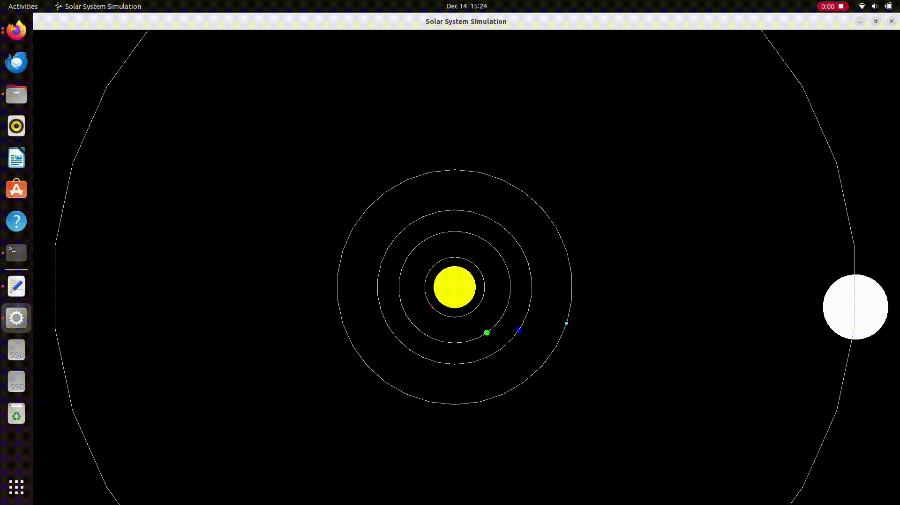

# Simple Solar System Simulation in C++

This project is a simple 2D solar system simulation implemented in C++ using **SFML** for graphics.  
It was created for fun and primarily as a practice exercise to improve C++ skills with **classes**, object-oriented design, and SFML.

> ⚠️ The simulation is not realistic. The goal was not scientific accuracy, but practicing C++ programming. Many improvements could be made in the future.

---

## Features

- Simulates a sun and multiple planets orbiting it.
- Each planet has customizable:
  - Radius
  - Orbit speed
  - Distance from the sun
  - Color
- Planets follow circular orbits around the sun.
- Renders planets and their orbits in real time using **SFML**.
- Easily extendable by adding more planets in `main.cpp`.

---

## Code Structure

The project consists of the following files:

### 1. `Planet.hpp`

- Defines the `Planet` class.
- Attributes:
  - `radius`, `orbit speed`, `distance from sun`, `color`, `current position`.
- Methods:
  - Constructor: initializes a planet.
  - `ComputePosition(double dt)`: updates planet position based on elapsed time.
  - Getters: `get_position()`, `getDistanceFromSun()`, `getRadius()`, `getOrbitSpeed()`, `getColor()`.

### 2. `Planet.cpp`

- Implements all methods of the `Planet` class.
- Uses trigonometry to calculate a planet’s 2D orbit position.

### 3. `SolarSystem.hpp`

- Defines the `SolarSystem` class.
- Attributes:
  - Sun radius and coordinates.
  - Collection of planets (`std::vector<Planet>`).
- Methods:
  - `add_planet()` – add a planet to the system.
  - `draw_sun()` – render the sun.
  - `draw_planet()` – render all planets and their orbits.
  - `calculate_planet_pos()` – update all planets’ positions based on elapsed time.

### 4. `SolarSystem.cpp`

- Implements all methods of the `SolarSystem` class.
- Draws the sun and planets using SFML.
- Visualizes planets’ orbits as circles for clarity.

### 5. `main.cpp`

- Entry point of the application.
- Sets up the SFML window.
- Creates planet objects and adds them to the solar system.
- Uses an SFML clock to calculate elapsed time (`dt`) for smooth animation.
- Main loop updates positions and renders the solar system in real time.

---

## How to Run

1. Install SFML (https://www.sfml-dev.org/).
2. Clone the repository.
3. Compile using CMake or your preferred IDE.
4. Run the executable. A window will open showing the sun and planets orbiting.

---

## Notes

- Planet distances and radius are scaled down to fit the window visually.
- Orbit speeds are scaled for demonstration purposes.
- Colors are for visualization only; not scientifically accurate.
- The simulation can be extended by adding more planets or features (planet labels, zooming, GUI, etc.).

---

## Author

- Practice project by CHEHABI Med.
- Goal: improve C++ skills and practice object-oriented design.

